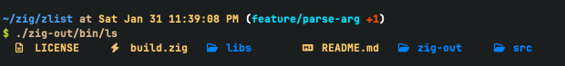
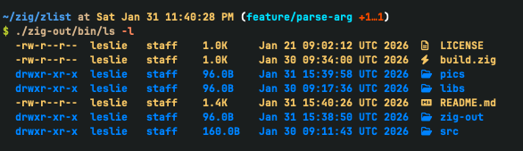

# zlist [](https://img.shields.io/badge/build-passing-brightgreen?style=for-the-badge)  [](https://img.shields.io/badge/zig-0.16.0_dev.2368+380ea6fb5-green)

A modern, high-performance alternative to ls, written in Zig.

**(The timing maybe is just not right. I need more time to work on this tiny project.)**

## Screenshots





## Features
- **Fast**: Written in Zig for high performance.
- **Colorful**: Color-coded output for different file types.
- **Detailed**: View file permissions, owner, group, size, and modification time.
- **Icons**: File type icons for better visual recognition (Requires a Nerd Font).
- **Flexible**: Supports standard `ls` flags like `-a` (all files) and `-l` (long listing).

## Usage

```bash
ls -h
-h, --help    Usage: ls [OPTIONS: -l -a] [Directory]
-l, --long    List files in the long format.
-a, --a       Include directory entries whose names begin with a dot (‘.’).
<str>...
```

## Installation

### Download precompiled binary

**TODO**

You can download the latest precompiled binary from the [releases page]().

### Build from source

```bash
git clone --recursive https://github.com/here-Leslie-Lau/zlist.git && cd zlist
zig build -Doptimize=ReleaseSafe
```

Then, move the compiled binary (In `zig-out/bin`) to a directory in your PATH, e.g., `/usr/local/bin`.

Or you can run it directly:

```bash
./zig-out/bin/ls
```

## Contributing

Contributions are welcome! Please feel free to:
- Report bugs via [Issues](https://github.com/here-Leslie-Lau/zlist/issues)
- Submit [Pull Requests](https://github.com/here-Leslie-Lau/zlist/pulls)
- Suggest new features or improvements

## Roadmap

- [X] Support basic options (-a, -l)
- [X] Support specific path to list
- [X] Colorized output
- [X] File icons support
- [X] Detailed file information (permissions, user/group, size, time)
- [ ] Precompile binaries for major platforms
- [ ] Support recursive options (-R)
- [ ] Support more sorting options

## License

This project is open source. See the LICENSE file for details.
